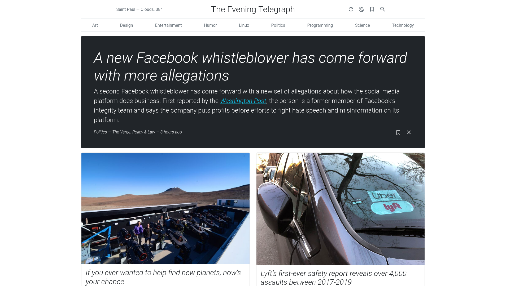
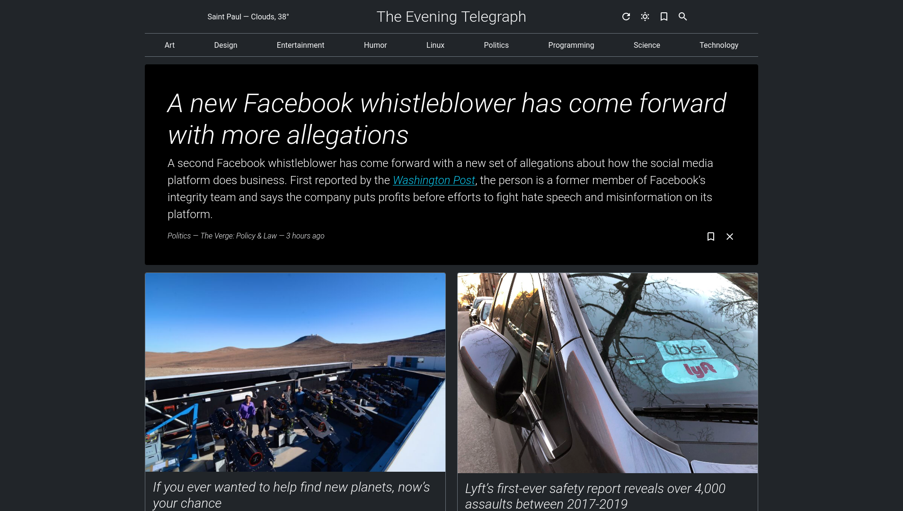
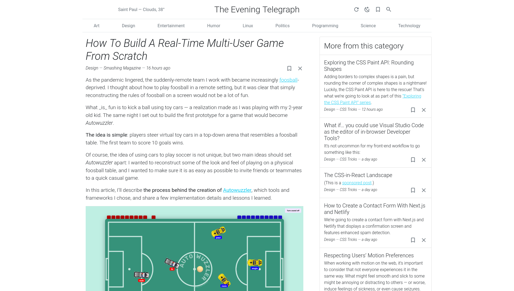
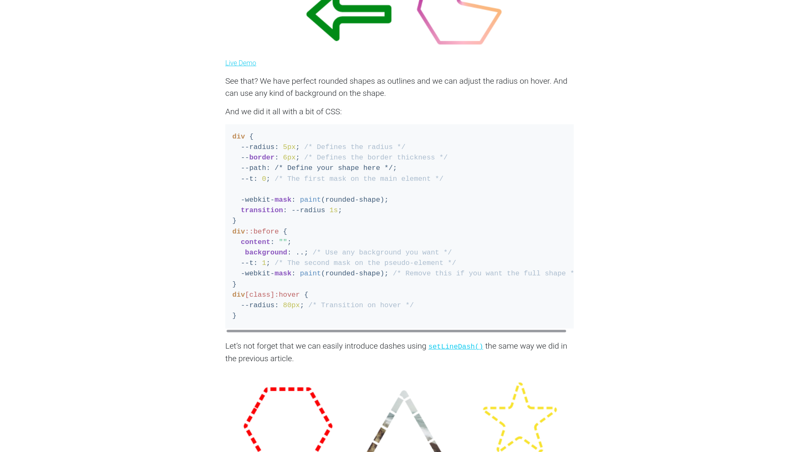
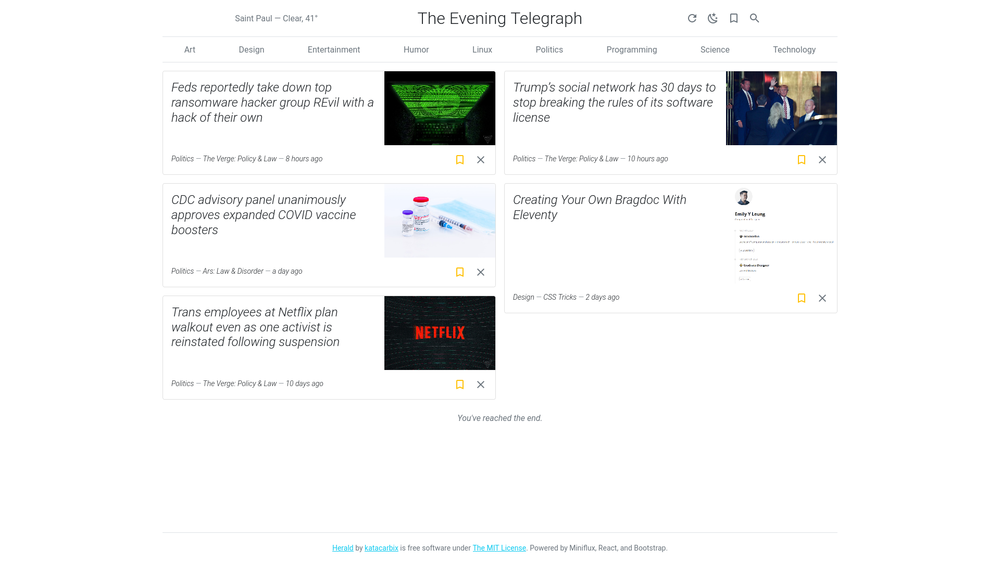
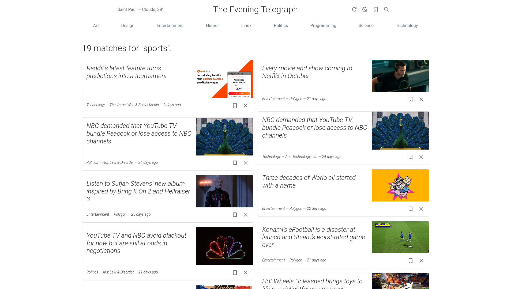

<div align="center">
  <br>
  Prettier frontend for the <a href="https://miniflux.app/index.html">Miniflux</a> feed reader using Express, React, and Bootstrap<br>
  <a href="https://github.com/katacarbix/herald/releases"></a>
  <a href="https://github.com/katacarbix/herald/actions"></a>
  <a href="https://hub.docker.com/repository/docker/katacarbix/herald"></a>
  <a href="LICENSE"></a>
</div>

#### NOTE: This project is in beta and is not guaranteed to be stable. Proceed at your own risk!

## Features
- Responsive newspaper/magazine-like layout with Bootstrap
- Light and dark mode
- Infinite scroll
- Full-text search
- Bookmarks
- Basic weather widget (only supports OpenWeatherMap for now)
- Syntax highlighting in code blocks powered by [highlight.js](https://highlightjs.org/)
- Mark articles as read just by scrolling to the bottom (or with a button)

Screenshots can be found at [the end](#what-does-herald-look-like) of this document.

## Limitations
- Intentionally implements only a subset of the Miniflux API to minimize potential damage that could be caused by malicious visitors.
- Article contents are only as good as what is provided by Miniflux. I recommend telling Miniflux to fetch original contents and setting [rules](https://miniflux.app/docs/rules.html) to get the best quality.
- Opinionated. I'm making this for *me* first, and some of the design choices may reflect that.

## Setup
1. [Install Miniflux](https://miniflux.app/docs/installation.html), then add some categories and feeds.
2. In your Miniflux instance, go to `Settings` -> `API Keys`, and click the `Create a new API key` button. Enter a name for this key (such as `herald`) and click `Save`.
3. Copy the API Endpoint URL and the newly created key and save them as the `MINIFLUX_API_ENDPOINT` and `MINIFLUX_API_KEY` environment variables (respectively).
4. Install Herald with one of the methods below. It should be on a host on the same network as Miniflux.
5. Optionally you can put Herald behind a reverse proxy to make it available from the outside. even though there's not much someone can do to mess with your Herald instance, it's highly recommended to password protect it if it's accessible from the public internet.

### Docker Compose
```yaml
version: '3.8'
services:
  miniflux:
    image: miniflux/miniflux:latest
    ports:
      - 1234:8080
    ...
  
  herald:
    image: katacarbix/herald:latest # see below section for list of tags
    ports:
      - 80:5000
    environment:
      - MINIFLUX_API_ENDPOINT=http://miniflux:1234/v1/
      - MINIFLUX_API_KEY=<api key>
```

### Docker
```sh
docker run -it -e MINIFLUX_API_ENDPOINT=<api url> MINIFLUX_API_KEY=<api key> -p 80:5000 katacarbix/herald:latest
```

### Bare metal
1. Download the prepared code from [Releases](https://github.com/katacarbix/herald/releases) and extract it.
2. Copy `sample.env` to `.env` and enter your environment variables into this new file.
3. Open a terminal and `cd` into the extracted directory.
4. Start Herald with `npm run production` (or `yarn production` if you have that installed).  
   You will need to run this command and leave the terminal open every time you want to start it. You can stop it with `Ctrl+C`.

## Docker tags
- `latest` - The most recent stable release
- `edge` - The most recent commit, may not be stable
- `v0`, `v0.2`, `v0.2.0`, `v0.1`, `v0.1.1` - A major/minor/patch version (note the leading `v`)

## Environment variables
| variable name           | description                                                                                  | example value                                         |
|:------------------------|:---------------------------------------------------------------------------------------------|:------------------------------------------------------|
| `MINIFLUX_API_ENDPOINT` | URL to your Miniflux instance's API. Required.                                               | `http://localhost:1234/v1/`                           |
| `MINIFLUX_API_KEY`      | Miniflux API key. Required.                                                                  | `eW91IGZvdW5kIGEgc2VjcmV0IG1lc3NhZ2UhISEgOkQ=`        |
| `NEWSPAPER_NAME`        | Title shown at the top of each page. Doesn't affect window/tab title. Optional.              | `The Daily Bugle` (default is procedurally generated) |
| `OWM_API_KEY`           | OpenWeatherMap API key (only required if you want the weather at the top)                    | `68656c6c6f20616761696e2121203a44`                    |
| `OWM_LATITUDE`          | Your location for the weather                                                                | `40.742054`                                           |
| `OWM_LONGITUDE`         | =                                                                                            | `-73.769417`                                          |
| `OWM_LANG`              | Language ([see options](https://openweathermap.org/current#multi))                           | `en` (default)                                        |
| `OWM_UNITS`             | Unit system ([see options](https://openweathermap.org/current#data))                         | `standard` (default)                                  |
| `PORT`                  | Port to expose Herald on. This would be on the right side for Docker port mapping. Optional. | `5000` (default)                                      |

## What does Herald look like?
|                                                       |                                                          |
|:-----------------------------------------------------:|:--------------------------------------------------------:|
|   |  |
|  |              |
|            |             |
